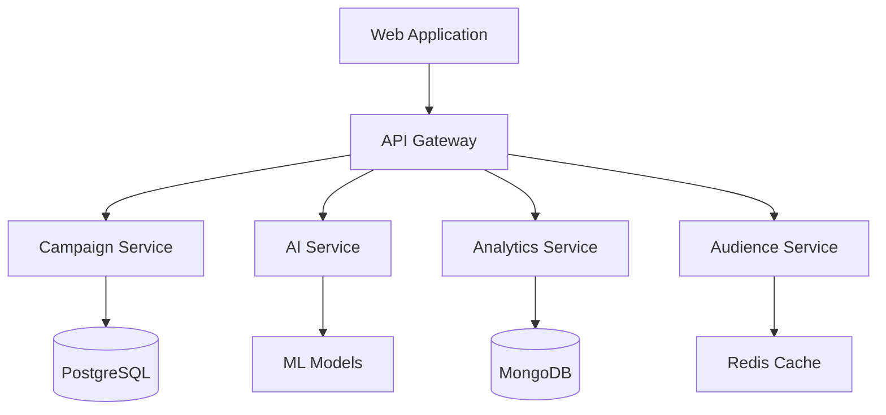

# Sales & Intelligence Platform

[](https://github.com/org/sales-intelligence-platform/actions)
[](https://codecov.io/gh/org/sales-intelligence-platform)
[](https://sonarcloud.io/dashboard?id=org_sales-intelligence-platform)
[](LICENSE)

An enterprise-grade AI-powered platform for automating and optimizing B2B digital advertising campaigns across LinkedIn Ads and Google Ads platforms.

## Features

- 🤖 AI-automated campaign structure generation
- 🎯 Intelligent audience targeting and segmentation
- 📊 Real-time performance analytics and optimization
- 🔒 Enterprise-grade security and compliance
- ⚡ High-performance microservices architecture

## System Architecture



## Prerequisites

- Node.js >= 18.17.0
- Python >= 3.11.0
- Docker >= 24.0.0
- Docker Compose >= 2.20.0
- NVIDIA Container Toolkit (for GPU support)
- AWS/GCP/Azure credentials
- LinkedIn and Google Ads API access

## Quick Start

1. Clone the repository:
```bash
git clone <repository-url>
cd sales-intelligence-platform
```

2. Configure environment variables:
```bash
cp .env.example .env
# Edit .env with your configuration
```

3. Start services with Docker:
```bash
docker-compose up -d
```

4. Access the application:
- Frontend: http://localhost:3000
- API Documentation: http://localhost:8000/docs
- Monitoring: http://localhost:3000/monitoring

## Development

### Project Structure
```
sales-intelligence-platform/
├── src/
│   ├── web/                 # Next.js frontend
│   ├── backend/            # Python microservices
│   ├── common/             # Shared utilities
│   └── test/              # Test suites
├── docs/                  # Documentation
├── monitoring/           # Monitoring configuration
└── deployment/          # Deployment manifests
```

### Available Scripts

```bash
# Frontend Development
cd src/web
npm install
npm run dev

# Backend Development
cd src/backend
python -m venv venv
source venv/bin/activate  # or `venv\Scripts\activate` on Windows
pip install -r requirements.txt
python -m uvicorn main:app --reload

# Testing
npm run test              # Run all tests
npm run test:unit        # Run unit tests
npm run test:integration # Run integration tests
npm run test:e2e        # Run end-to-end tests
npm run test:security   # Run security tests
```

## Security Features

- OAuth 2.0 / OpenID Connect authentication
- Role-based access control (RBAC)
- AES-256-GCM encryption (FIPS 140-2 compliant)
- API security with rate limiting
- GDPR and CCPA compliance
- Regular security audits and penetration testing

## Deployment

### Production Setup

1. Build production images:
```bash
docker-compose -f docker-compose.prod.yml build
```

2. Deploy with high availability:
```bash
docker-compose -f docker-compose.prod.yml up -d
```

### Cloud Infrastructure

- Kubernetes orchestration
- Multi-AZ deployment
- Auto-scaling configuration
- Load balancing
- CDN integration
- Disaster recovery

## Monitoring & Observability

- Prometheus metrics
- Grafana dashboards
- Jaeger distributed tracing
- ELK Stack logging
- Real-time alerts

Access monitoring:
- Grafana: http://localhost:3000
- Prometheus: http://localhost:9090
- Jaeger: http://localhost:16686

## Performance Optimization

- Server-side rendering (SSR)
- Redis caching
- Database connection pooling
- Message queue batching
- GPU acceleration for AI services
- CDN for static assets

## Documentation

- [API Documentation](docs/api/README.md)
- [Frontend Documentation](src/web/README.md)
- [Backend Documentation](src/backend/README.md)
- [Security Guidelines](docs/security/README.md)
- [Deployment Guide](docs/deployment/README.md)

## Contributing

1. Create a feature branch
2. Make your changes
3. Run tests and security checks
4. Submit a pull request

## Support

For support and issues:
1. Check documentation
2. Contact development team
3. Create GitHub issue

## License

Proprietary - All rights reserved

Copyright © 2024 Sales Intelligence Platform Team