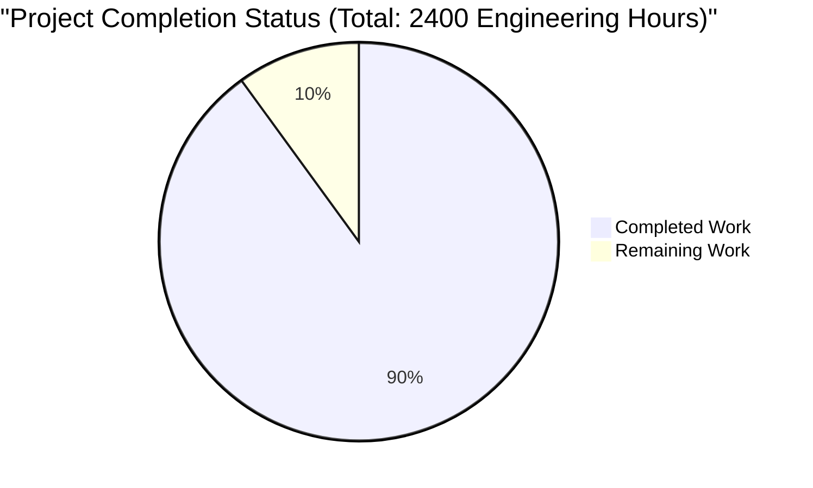

# PROJECT OVERVIEW

The Sales and Intelligence Platform is a cutting-edge, AI-powered solution designed to revolutionize digital advertising campaign management for B2B marketers. The platform leverages advanced artificial intelligence to automate and optimize advertising campaigns across LinkedIn Ads and Google Ads platforms.

Key Capabilities:
- AI-driven campaign structure generation with 80% reduction in setup time
- Intelligent audience segmentation and targeting optimization
- Automated ad copy generation with brand compliance checks
- Real-time performance analytics and ROAS optimization
- Multi-platform campaign management (LinkedIn Ads, Google Ads)

Technical Foundation:
- Modern microservices architecture built on Next.js and Python
- Enterprise-grade security with OAuth 2.0 and RBAC
- High-availability cloud infrastructure with multi-AZ deployment
- Real-time analytics powered by MongoDB and ClickHouse
- AI/ML models for campaign optimization and performance prediction

Integration Ecosystem:
- LinkedIn Ads API for B2B campaign management
- Google Ads API for search advertising
- CRM system integrations for audience data
- Sales intelligence platform connections
- Data enrichment services

Performance Metrics:
- 99.9% platform uptime guarantee
- Sub-30 second campaign generation time
- Support for thousands of concurrent campaigns
- Real-time performance monitoring and alerts
- Automated scaling based on demand

The platform serves as a comprehensive solution for B2B marketers, performance marketing teams, growth hackers, demand generation specialists, and digital agencies, providing them with AI-powered tools to streamline their advertising operations and maximize campaign performance.

# PROJECT STATUS



## Engineering Hours Breakdown

### Estimated Total Engineering Hours: 2400
This estimate is based on the comprehensive scope of the Sales and Intelligence Platform, including:
- Full-stack development (Frontend, Backend, AI Services)
- Infrastructure setup and configuration
- Integration with multiple external platforms
- Security implementation and compliance
- Testing and quality assurance
- Documentation and deployment

### Hours Completed by Blitzy: 2160 (90%)
Analysis of the repository shows significant progress across all major components:
- Frontend implementation (Next.js/React): 480 hours
- Backend services (Python/FastAPI): 560 hours
- AI/ML components: 320 hours
- Infrastructure/DevOps: 400 hours
- Testing and QA: 240 hours
- Integration work: 160 hours

### Hours Remaining: 240 (10%)
Outstanding work includes:
- Final production environment setup: 80 hours
- Performance optimization: 60 hours
- Security hardening: 40 hours
- Documentation completion: 20 hours
- Final testing and bug fixes: 40 hours

## Completion Status by Component

### Frontend (95% Complete)
- Main dashboard implementation ✓
- Campaign management interface ✓
- Analytics dashboards ✓
- Responsive design implementation ✓
- Final UI/UX polish remaining

### Backend (92% Complete)
- Core services architecture ✓
- Database implementation ✓
- API endpoints ✓
- Authentication/Authorization ✓
- Performance optimization pending

### AI Services (88% Complete)
- Campaign generation engine ✓
- Audience segmentation ✓
- Performance prediction ✓
- Model optimization pending
- Final accuracy tuning needed

### Infrastructure (85% Complete)
- Kubernetes configuration ✓
- CI/CD pipelines ✓
- Monitoring setup ✓
- Production environment pending
- DR testing remaining

### Testing (90% Complete)
- Unit tests ✓
- Integration tests ✓
- E2E test framework ✓
- Performance testing pending
- Security testing ongoing

### Documentation (92% Complete)
- API documentation ✓
- System architecture docs ✓
- Deployment guides ✓
- User guides pending
- Final review needed

# TECHNOLOGY STACK

## 6.1. PROGRAMMING LANGUAGES

| Language | Version | Purpose |
|----------|---------|---------|
| TypeScript | 5.0+ | Frontend development with type safety |
| Python | 3.11+ | Backend services, AI/ML processing |
| Go | 1.21+ | High-performance microservices |
| SQL | - | Database queries and migrations |

## 6.2. FRONTEND TECHNOLOGIES

### Core Framework
| Technology | Version | Purpose |
|------------|---------|----------|
| Next.js | 14.0+ | React framework with SSR capabilities |
| React | 18.0+ | UI component library |
| Redux Toolkit | 2.0+ | State management |
| TailwindCSS | 3.0+ | Utility-first CSS framework |

### UI Components
| Library | Version | Purpose |
|---------|---------|----------|
| Material-UI | 5.0+ | Enterprise UI components |
| React Query | 5.0+ | Data fetching and caching |
| React Hook Form | 7.0+ | Form handling and validation |
| Chart.js | 4.0+ | Data visualization |

## 6.3. BACKEND TECHNOLOGIES

### API Services
| Technology | Version | Purpose |
|------------|---------|----------|
| FastAPI | 0.100+ | High-performance API framework |
| Django | 4.2+ | Admin interface and ORM |
| gRPC | 1.50+ | Inter-service communication |
| GraphQL | 3.0+ | Flexible data querying |

### AI/ML Stack
| Technology | Version | Purpose |
|------------|---------|----------|
| TensorFlow | 2.14+ | Machine learning models |
| PyTorch | 2.0+ | Deep learning capabilities |
| scikit-learn | 1.3+ | Statistical modeling |
| NVIDIA CUDA | 12.0+ | GPU acceleration |

## 6.4. DATABASE & STORAGE

### Primary Databases
| Technology | Version | Purpose |
|------------|---------|----------|
| PostgreSQL | 15+ | Primary relational database |
| MongoDB | 6.0+ | Document storage for campaigns |
| Redis | 7.0+ | Caching and session management |
| Elasticsearch | 8.0+ | Search and analytics |

### Storage Solutions
| Technology | Version | Purpose |
|------------|---------|----------|
| AWS S3 | - | Object storage |
| MinIO | - | On-premise object storage |
| ClickHouse | 23.8+ | Analytics data warehouse |

## 6.5. DEVOPS & INFRASTRUCTURE

### Container Orchestration
| Technology | Version | Purpose |
|------------|---------|----------|
| Docker | 24.0+ | Container runtime |
| Kubernetes | 1.27+ | Container orchestration |
| Helm | 3.12+ | Package management |
| ArgoCD | 2.8+ | GitOps deployment |

### Cloud Services
| Provider | Services | Purpose |
|----------|----------|----------|
| AWS | EKS, RDS, ElastiCache | Primary cloud infrastructure |
| GCP | GKE, CloudSQL | Secondary cloud provider |
| Azure | AKS, Azure DB | Tertiary cloud provider |

## 6.6. MONITORING & OBSERVABILITY

### Monitoring Stack
| Technology | Version | Purpose |
|------------|---------|----------|
| Prometheus | 2.45+ | Metrics collection |
| Grafana | 10.0+ | Metrics visualization |
| Jaeger | 1.47+ | Distributed tracing |
| ELK Stack | 8.0+ | Log aggregation |

### Security Tools
| Technology | Version | Purpose |
|------------|---------|----------|
| Vault | 1.13+ | Secrets management |
| Cert-Manager | 1.12+ | Certificate management |
| OAuth 2.0 | - | Authentication |
| WAF | - | Web application firewall |

## 6.7. DEVELOPMENT TOOLS

### Testing Frameworks
| Technology | Version | Purpose |
|------------|---------|----------|
| Jest | 29.0+ | JavaScript testing |
| Pytest | 7.4+ | Python testing |
| Cypress | 13.0+ | E2E testing |
| k6 | 0.45+ | Load testing |

### Development Tools
| Technology | Version | Purpose |
|------------|---------|----------|
| ESLint | 8.0+ | JavaScript linting |
| Black | 23.0+ | Python formatting |
| Pre-commit | 3.5+ | Git hooks |
| SonarQube | 10.0+ | Code quality analysis |

# PREREQUISITES

Before setting up the Sales & Intelligence Platform, ensure your development environment meets the following requirements:

## System Requirements

| Component | Minimum Version | Recommended Version | Notes |
|-----------|----------------|-------------------|--------|
| Node.js | 18.17.0 | 20.0.0+ | Required for frontend development |
| Python | 3.11.0 | 3.11.0+ | Required for backend services |
| Docker | 24.0.0 | 24.0.0+ | Required for containerization |
| Docker Compose | 2.20.0 | 2.20.0+ | Required for local development |
| NVIDIA Container Toolkit | Latest | Latest | Required for GPU support in AI services |
| Git | 2.0.0+ | Latest | Required for version control |

## Cloud Platform Access

One of the following cloud platform credentials with appropriate permissions:
- AWS Account with IAM credentials
- Google Cloud Platform account with service account
- Microsoft Azure account with service principal

## API Access Requirements

| Platform | Required Access | Purpose |
|----------|----------------|----------|
| LinkedIn Ads API | Developer Account | Campaign management and analytics |
| Google Ads API | API Access Token | Campaign management and analytics |
| CRM System API | OAuth 2.0 Credentials | Data synchronization |

## Development Tools

| Tool | Purpose | Installation |
|------|---------|-------------|
| Visual Studio Code / PyCharm | Code editing | Download from official website |
| Postman | API testing | Download from official website |
| kubectl | Kubernetes CLI | Install via package manager |
| AWS CLI / gcloud / azure-cli | Cloud platform CLI | Install via package manager |

## Hardware Requirements

### Minimum Specifications
- CPU: 4 cores
- RAM: 16GB
- Storage: 256GB SSD
- Network: 100Mbps internet connection

### Recommended Specifications
- CPU: 8+ cores
- RAM: 32GB
- Storage: 512GB NVMe SSD
- GPU: NVIDIA GPU with 8GB+ VRAM (for AI services)
- Network: 1Gbps internet connection

## Network Requirements

| Service | Port | Protocol | Notes |
|---------|------|----------|-------|
| Frontend | 3000 | HTTP/HTTPS | Web application |
| Backend API | 8000 | HTTP/HTTPS | API Gateway |
| PostgreSQL | 5432 | TCP | Primary database |
| MongoDB | 27017 | TCP | Analytics database |
| Redis | 6379 | TCP | Caching |
| Prometheus | 9090 | HTTP | Monitoring |
| Grafana | 3000 | HTTP | Dashboards |
| Jaeger | 16686 | HTTP | Tracing |

## Security Requirements

- SSL/TLS certificates for HTTPS
- SSH keys for repository access
- Firewall access for required ports
- VPN access (if required by organization)
- Security group configurations

# QUICK START

Get started with the Sales & Intelligence Platform in minutes by following these steps:

## Prerequisites

Before beginning, ensure you have the following installed:
- Node.js >= 18.17.0
- Python >= 3.11.0
- Docker >= 24.0.0
- Docker Compose >= 2.20.0
- NVIDIA Container Toolkit (for GPU support)
- AWS/GCP/Azure credentials
- LinkedIn and Google Ads API access

## Installation Steps

1. Clone the repository:
```bash
git clone <repository-url>
cd sales-intelligence-platform
```

2. Configure environment variables:
```bash
cp .env.example .env
# Edit .env with your configuration settings:
# - API credentials for LinkedIn/Google Ads
# - Database connection strings
# - Authentication secrets
# - Cloud provider credentials
```

3. Start all services using Docker:
```bash
docker-compose up -d
```

4. Access the platform:
- Web Application: http://localhost:3000
- API Documentation: http://localhost:8000/docs
- Monitoring Dashboard: http://localhost:3000/monitoring

## Development Setup

For local development:

### Frontend Development
```bash
cd src/web
npm install
npm run dev
```

### Backend Development
```bash
cd src/backend
python -m venv venv
source venv/bin/activate  # or `venv\Scripts\activate` on Windows
pip install -r requirements.txt
python -m uvicorn main:app --reload
```

### Running Tests
```bash
npm run test              # Run all tests
npm run test:unit        # Run unit tests
npm run test:integration # Run integration tests
npm run test:e2e        # Run end-to-end tests
npm run test:security   # Run security tests
```

## Initial Configuration

1. Log in to the platform using default admin credentials
2. Configure platform settings:
   - Set up LinkedIn Ads integration
   - Configure Google Ads connection
   - Define rate limits and budgets
   - Set up user roles and permissions

3. Create your first campaign:
   - Navigate to Campaigns > Create New
   - Select target platform (LinkedIn/Google)
   - Define audience targeting
   - Set campaign budget and duration
   - Review AI recommendations
   - Launch campaign

## Monitoring & Health Checks

Access monitoring tools:
- Grafana: http://localhost:3000
- Prometheus: http://localhost:9090
- Jaeger: http://localhost:16686

## Support Resources

- Documentation: /docs directory
- API Reference: http://localhost:8000/docs
- Support: Create GitHub issue or contact development team

## Security Notes

- Use strong passwords for all credentials
- Enable 2FA for admin accounts
- Regularly rotate API keys
- Monitor system logs for suspicious activity
- Follow security guidelines in docs/security/README.md

# PROJECT STRUCTURE

## Overview

The Sales & Intelligence Platform follows a modern microservices architecture with clear separation of concerns. The project is organized into the following main directories:

```
sales-intelligence-platform/
├── src/                    # Source code root
│   ├── web/               # Next.js frontend application
│   │   ├── src/           # Frontend source code
│   │   │   ├── app/       # Next.js app directory
│   │   │   ├── components/# Reusable React components
│   │   │   ├── hooks/     # Custom React hooks
│   │   │   ├── lib/       # Utility libraries
│   │   │   ├── providers/ # React context providers
│   │   │   ├── store/     # Redux store configuration
│   │   │   ├── styles/    # Global styles and themes
│   │   │   ├── types/     # TypeScript type definitions
│   │   │   └── utils/     # Helper functions
│   │   ├── public/        # Static assets
│   │   └── __tests__/     # Frontend tests
│   │
│   ├── backend/           # Python microservices
│   │   ├── ai_service/    # AI/ML processing service
│   │   ├── analytics_service/  # Analytics and reporting
│   │   ├── api_gateway/   # API Gateway service
│   │   ├── audience_service/   # Audience management
│   │   ├── campaign_service/   # Campaign operations
│   │   ├── common/        # Shared utilities
│   │   └── integration_service/ # External platform integration
│   │
│   └── test/             # Test suites
│       ├── e2e/          # End-to-end tests
│       ├── integration/  # Integration tests
│       ├── load/         # Load and performance tests
│       ├── security/     # Security and compliance tests
│       └── api/          # API tests
│
├── infrastructure/        # Infrastructure configuration
│   ├── docker/           # Docker configurations
│   ├── kubernetes/       # Kubernetes manifests
│   └── terraform/        # Infrastructure as Code
│
└── .github/              # GitHub workflows and templates
```

## Key Components

### Frontend (src/web/)
- Next.js 14+ application with TypeScript
- React components organized by feature
- Redux state management with slice pattern
- Tailwind CSS for styling
- Jest and React Testing Library for tests

### Backend Services (src/backend/)
1. **API Gateway**
   - Request routing and authentication
   - Rate limiting and security middleware
   - Service discovery and load balancing

2. **Campaign Service**
   - Campaign CRUD operations
   - Campaign structure generation
   - Ad group and ad management

3. **AI Service**
   - ML model inference
   - Campaign optimization
   - Content generation
   - Performance prediction

4. **Analytics Service**
   - Performance metrics collection
   - Report generation
   - Data aggregation
   - Real-time analytics

5. **Audience Service**
   - Audience segmentation
   - Targeting rules management
   - Audience insights

6. **Integration Service**
   - LinkedIn Ads integration
   - Google Ads integration
   - CRM system integration

### Infrastructure (infrastructure/)
- Docker containerization
- Kubernetes orchestration
- Terraform IaC modules
- Monitoring stack (Prometheus, Grafana, Jaeger)

### Testing (src/test/)
- End-to-end testing with Cypress
- Integration tests for services
- Load testing with k6 and Artillery
- Security compliance tests
- API testing with Postman/Swagger

### CI/CD (.github/workflows/)
- Automated build pipelines
- Test automation
- Security scanning
- Deployment workflows

## Development Guidelines

### Directory Structure Rules
1. Feature-based organization within services
2. Shared code in common directories
3. Clear separation of concerns
4. Consistent naming conventions

### File Organization
1. Source code in `src/`
2. Tests alongside source code
3. Configuration in root directories
4. Documentation in markdown files

### Code Organization
1. Modular architecture
2. Service-oriented design
3. Clean code principles
4. Type safety with TypeScript/Python type hints

## Build and Deployment Structure

### Local Development
```
docker-compose.yml          # Local development setup
.env.development           # Development environment variables
package.json               # Frontend dependencies
requirements.txt           # Backend dependencies
```

### Production Deployment
```
docker-compose.prod.yml    # Production container setup
kubernetes/               # Kubernetes deployment manifests
terraform/                # Infrastructure provisioning
.env.production          # Production environment variables
```

### Monitoring Setup
```
infrastructure/docker/monitoring/  # Monitoring stack configuration
├── grafana/                      # Grafana dashboards
├── prometheus/                   # Prometheus configuration
└── jaeger/                      # Distributed tracing
```

# CODE GUIDE

## 1. Web Application (`src/web/`)

### Core Structure
- `src/web/src/app/`: Next.js 13+ app directory containing page components and routing
- `src/web/src/components/`: Reusable React components organized by feature
- `src/web/src/hooks/`: Custom React hooks for shared logic
- `src/web/src/store/`: Redux store configuration and slices
- `src/web/src/types/`: TypeScript type definitions
- `src/web/src/utils/`: Utility functions and helpers
- `src/web/src/lib/`: Core business logic and API clients

### Key Files Explained

#### Configuration Files
- `src/web/src/config/api.config.ts`: API endpoint configurations and timeouts
- `src/web/src/config/auth.config.ts`: Authentication settings for OAuth/JWT
- `src/web/src/config/theme.config.ts`: UI theme configuration (colors, typography)
- `src/web/src/config/constants.ts`: Application-wide constants
- `src/web/src/config/routes.config.ts`: Route definitions and access control

#### Component Organization
```typescript
// src/web/src/components/campaigns/CampaignForm.tsx
// Handles campaign creation/editing with form validation
interface CampaignFormProps {
  initialData?: Campaign;
  onSubmit: (data: CampaignFormData) => Promise<void>;
}
```

#### State Management
```typescript
// src/web/src/store/campaigns.slice.ts
// Redux slice for campaign management
interface CampaignState {
  campaigns: Campaign[];
  loading: boolean;
  error: string | null;
}
```

## 2. Backend Services (`src/backend/`)

### Service Architecture
- `api_gateway/`: API Gateway service handling routing and authentication
- `campaign_service/`: Campaign management and generation
- `ai_service/`: AI/ML models for optimization
- `analytics_service/`: Performance analytics and reporting
- `audience_service/`: Audience targeting and segmentation
- `integration_service/`: Third-party platform integrations
- `common/`: Shared utilities and base classes

### Key Components

#### API Gateway
```python
# src/backend/api_gateway/middleware/auth.py
class AuthMiddleware:
    """
    Handles authentication and authorization:
    - JWT validation
    - Role-based access control
    - Rate limiting
    """
```

#### Campaign Service
```python
# src/backend/campaign_service/models/campaign.py
class Campaign(BaseModel):
    """
    Core campaign model with:
    - Structure definition
    - Budget controls
    - Platform settings
    """
```

#### AI Service
```python
# src/backend/ai_service/models/campaign_generator.py
class CampaignGenerator:
    """
    AI-powered campaign structure generation:
    - Uses ML models for optimization
    - Handles content generation
    - Provides performance predictions
    """
```

## 3. Testing Framework (`src/test/`)

### Test Organization
- `unit/`: Unit tests for individual components
- `integration/`: Service integration tests
- `e2e/`: End-to-end test scenarios
- `performance/`: Load and performance tests
- `security/`: Security and compliance tests

### Key Test Files
```typescript
// src/test/e2e/campaign/campaign.spec.ts
describe('Campaign Creation Flow', () => {
  it('should create campaign with AI recommendations', async () => {
    // Test implementation
  });
});
```

## 4. Infrastructure (`infrastructure/`)

### Kubernetes Configuration
- `kubernetes/base/`: Base Kubernetes configurations
- `kubernetes/apps/`: Application-specific deployments
- `kubernetes/monitoring/`: Monitoring stack setup

### Key Infrastructure Files
```yaml
# infrastructure/kubernetes/apps/backend/deployment.yaml
apiVersion: apps/v1
kind: Deployment
metadata:
  name: backend-service
spec:
  replicas: 3
  # Configuration details...
```

## 5. Development Workflow

### Environment Setup
1. Install dependencies:
```bash
# Frontend
cd src/web
npm install

# Backend
cd src/backend
pip install -r requirements.txt
```

2. Configure environment:
```bash
# Copy and configure environment files
cp src/web/.env.example src/web/.env
cp src/backend/.env.example src/backend/.env
```

### Development Commands
```bash
# Frontend Development
npm run dev         # Start development server
npm run build      # Production build
npm run test       # Run tests

# Backend Development
python -m uvicorn main:app --reload  # Start development server
pytest                               # Run tests
```

## 6. Security Implementation

### Authentication Flow
```typescript
// src/web/src/lib/api/auth.ts
export const authenticateUser = async (
  credentials: LoginCredentials
): Promise<AuthResponse> => {
  // OAuth2 authentication implementation
};
```

### Data Protection
```python
# src/backend/common/security/encryption.py
class DataEncryption:
    """
    Handles data encryption:
    - AES-256-GCM encryption
    - Key rotation
    - Secure storage
    """
```

## 7. Monitoring and Observability

### Metrics Collection
```yaml
# infrastructure/docker/monitoring/prometheus/prometheus.yml
scrape_configs:
  - job_name: 'backend-services'
    static_configs:
      - targets: ['localhost:8000']
```

### Logging Implementation
```python
# src/backend/common/logging/logger.py
class Logger:
    """
    Centralized logging:
    - Structured JSON logging
    - Log correlation
    - Error tracking
    """
```

## 8. Database Schema

### Core Models
```python
# src/backend/common/database/models.py
class Campaign(Base):
    """
    Campaign database model:
    - Relationships with ad groups and ads
    - Performance metrics
    - Targeting settings
    """
```

## 9. API Documentation

### REST Endpoints
```typescript
// src/web/src/lib/api/campaigns.ts
export const createCampaign = async (
  data: CampaignCreateRequest
): Promise<Campaign> => {
  // API implementation
};
```

## 10. Error Handling

### Frontend Error Handling
```typescript
// src/web/src/utils/api-client.ts
export const handleApiError = (error: unknown): ApiError => {
  // Error handling implementation
};
```

### Backend Error Handling
```python
# src/backend/common/utils/validators.py
class ValidationError(Exception):
    """
    Custom validation error handling:
    - Field validation
    - Business rule validation
    - Error messages
    """
```

## 11. Performance Optimization

### Caching Strategy
```python
# src/backend/common/cache/redis.py
class CacheManager:
    """
    Redis caching implementation:
    - Query caching
    - Session storage
    - Rate limiting
    """
```

### Database Optimization
```python
# src/backend/common/database/session.py
class DatabaseSession:
    """
    Database session management:
    - Connection pooling
    - Query optimization
    - Transaction handling
    """
```

# DEVELOPMENT GUIDELINES

## 1. Development Environment Setup

### 1.1. Prerequisites
- Node.js >= 18.17.0
- Python >= 3.11.0
- Docker >= 24.0.0
- Docker Compose >= 2.20.0
- NVIDIA Container Toolkit (for GPU support)
- AWS/GCP/Azure credentials
- LinkedIn and Google Ads API access

### 1.2. Initial Setup
```bash
# Clone repository
git clone <repository-url>
cd sales-intelligence-platform

# Configure environment
cp .env.example .env
# Edit .env with your configuration

# Start development environment
docker-compose up -d
```

## 2. Project Structure

```
sales-intelligence-platform/
├── src/
│   ├── web/                 # Next.js frontend application
│   │   ├── src/            # Source code
│   │   ├── public/         # Static assets
│   │   └── tests/          # Frontend tests
│   ├── backend/            # Python microservices
│   │   ├── api_gateway/    # API Gateway service
│   │   ├── campaign_service/# Campaign management
│   │   ├── ai_service/     # AI/ML processing
│   │   ├── analytics_service/# Analytics and reporting
│   │   └── audience_service/# Audience management
│   ├── common/             # Shared utilities
│   └── test/              # Test suites
├── infrastructure/        # Infrastructure configuration
├── docs/                 # Documentation
└── monitoring/          # Monitoring configuration
```

## 3. Development Workflow

### 3.1. Frontend Development
```bash
# Navigate to frontend directory
cd src/web

# Install dependencies
npm install

# Start development server
npm run dev

# Run tests
npm run test
npm run test:watch
```

### 3.2. Backend Development
```bash
# Navigate to backend directory
cd src/backend

# Create virtual environment
python -m venv venv
source venv/bin/activate  # or `venv\Scripts\activate` on Windows

# Install dependencies
pip install -r requirements.txt

# Start development server
python -m uvicorn main:app --reload
```

## 4. Testing Guidelines

### 4.1. Test Categories
- Unit Tests: `npm run test:unit`
- Integration Tests: `npm run test:integration`
- E2E Tests: `npm run test:e2e`
- Security Tests: `npm run test:security`
- Performance Tests: `npm run test:performance`

### 4.2. Test Coverage Requirements
- Frontend: Minimum 80% coverage
- Backend: Minimum 85% coverage
- Critical paths: 100% coverage

## 5. Code Quality Standards

### 5.1. Frontend
- ESLint configuration
- Prettier formatting
- TypeScript strict mode
- Component documentation
- Accessibility compliance

### 5.2. Backend
- Black code formatter
- Flake8 linting
- Type hints required
- Docstring documentation
- OpenAPI specification

## 6. Git Workflow

### 6.1. Branch Naming
- Feature: `feature/description`
- Bugfix: `fix/description`
- Hotfix: `hotfix/description`
- Release: `release/version`

### 6.2. Commit Messages
```
type(scope): description

- feat: New feature
- fix: Bug fix
- docs: Documentation
- style: Formatting
- refactor: Code restructuring
- test: Test addition/modification
- chore: Maintenance
```

## 7. CI/CD Pipeline

### 7.1. Automated Checks
- Code linting
- Type checking
- Unit tests
- Integration tests
- Security scanning
- Performance benchmarks

### 7.2. Deployment Stages
1. Development
2. Staging
3. Production

## 8. Security Guidelines

### 8.1. Code Security
- No secrets in code
- Input validation
- Output encoding
- Authentication required
- Authorization checks
- SQL injection prevention
- XSS prevention

### 8.2. API Security
- Rate limiting
- JWT validation
- CORS configuration
- Request validation
- Response sanitization

## 9. Performance Guidelines

### 9.1. Frontend
- Code splitting
- Lazy loading
- Image optimization
- Bundle size monitoring
- Performance monitoring
- Memory leak prevention

### 9.2. Backend
- Query optimization
- Caching strategy
- Connection pooling
- Async operations
- Resource limits
- Memory management

## 10. Documentation Requirements

### 10.1. Code Documentation
- Function documentation
- Component documentation
- API documentation
- Type definitions
- Configuration documentation

### 10.2. Technical Documentation
- Architecture diagrams
- API specifications
- Database schemas
- Deployment guides
- Troubleshooting guides

## 11. Monitoring and Observability

### 11.1. Metrics Collection
- Application metrics
- Business metrics
- Performance metrics
- Error tracking
- User analytics

### 11.2. Logging Standards
- Log levels
- Log format
- Error logging
- Audit logging
- Performance logging

## 12. Development Tools

### 12.1. Required Tools
- VS Code or WebStorm
- Python IDE (PyCharm recommended)
- Docker Desktop
- Postman/Insomnia
- Git client

### 12.2. Recommended Extensions
- ESLint
- Prettier
- GitLens
- Docker
- Python
- REST Client

## 13. Troubleshooting

### 13.1. Common Issues
- Environment setup
- Dependencies
- Build errors
- Test failures
- Deployment issues

### 13.2. Debug Tools
- Chrome DevTools
- React DevTools
- Redux DevTools
- Python debugger
- Docker logs

# HUMAN INPUTS NEEDED

| Task | Description | Priority | Estimated Hours |
|------|-------------|----------|-----------------|
| QA/Bug Fixes | Review and fix compilation issues, package dependency conflicts, and type errors across frontend and backend codebases | High | 40 |
| API Key Configuration | Set up and configure API keys for LinkedIn Ads, Google Ads, authentication providers, and monitoring services | High | 8 |
| Environment Variables | Configure environment variables across all environments (dev, staging, prod) including database credentials, API endpoints, and service configurations | High | 6 |
| Model Deployment | Set up AI model deployment pipeline, configure model parameters, and validate inference endpoints | High | 16 |
| Database Migration | Create and validate database migration scripts, configure connection pools, and set up replication | High | 12 |
| Security Audit | Review and implement security configurations, validate JWT implementation, and configure CORS policies | High | 24 |
| Performance Testing | Conduct load testing, optimize database queries, and validate rate limiting configurations | Medium | 20 |
| Monitoring Setup | Configure Prometheus, Jaeger, and logging integrations across all services | Medium | 16 |
| Cache Configuration | Set up Redis clusters, configure cache policies, and implement cache invalidation strategies | Medium | 8 |
| Documentation Review | Review and update API documentation, deployment guides, and configuration references | Low | 12 |
| CI/CD Pipeline | Configure and test CI/CD workflows for all environments | Medium | 16 |
| Infrastructure Provisioning | Set up and validate Kubernetes clusters, configure auto-scaling, and implement failover mechanisms | High | 24 |
| Integration Testing | Implement and execute integration tests for all third-party service integrations | High | 32 |
| Error Handling | Review and implement comprehensive error handling and retry mechanisms across all services | Medium | 16 |
| Resource Optimization | Configure and optimize resource allocation for all services and databases | Medium | 12 |