# Technical Specifications

# 1. INTRODUCTION

## 1.1. EXECUTIVE SUMMARY

The Sales and Intelligence Platform is an AI-powered solution designed to revolutionize digital advertising campaign creation and management for B2B marketers. The system automates the generation of campaign structures for LinkedIn Ads and Google Ads while providing intelligent audience targeting and performance optimization.

| Business Problem | Solution |
|-----------------|-----------|
| Manual campaign creation is time-consuming | AI-automated campaign structure generation |
| Inefficient audience targeting | Data-driven segmentation and targeting |
| Suboptimal ad performance | Predictive analytics and optimization |
| Resource-intensive campaign management | 80% reduction in campaign setup time |

**Key Stakeholders:** B2B Marketers, Performance Marketing Teams, Growth Hackers, Demand Generation Specialists, Digital Agencies

## 1.2. SYSTEM OVERVIEW

### Project Context

| Aspect | Details |
|--------|----------|
| Market Position | First-to-market AI-driven B2B ad campaign automation platform |
| Integration Landscape | LinkedIn Ads, Google Ads, CRM systems, Sales Intelligence Platforms |
| Technical Foundation | Cloud-based architecture with AI/ML capabilities |

### High-Level Description

**Primary Capabilities:**
- Automated campaign structure generation
- AI-powered audience segmentation
- Performance prediction and optimization
- Real-time analytics and reporting

**Core Technical Approach:**
- React.js/Next.js frontend
- Python backend (Django/FastAPI)
- Cloud infrastructure (AWS/GCP/Azure)
- AI/ML models for campaign optimization

### Success Criteria

| KPI Category | Metrics |
|--------------|---------|
| Efficiency | 80% reduction in campaign setup time |
| Performance | 99.9% platform uptime |
| Processing | Campaign generation within 30 seconds |
| Scale | Support for thousands of concurrent campaigns |

## 1.3. SCOPE

### In-Scope Elements

**Core Features:**
- Campaign structure generation
- Audience segmentation
- Ad copy generation
- Performance prediction
- Budget optimization
- Real-time analytics

**Implementation Coverage:**

| Aspect | Included Elements |
|--------|------------------|
| Platforms | LinkedIn Ads, Google Ads |
| Integrations | CRM systems, Sales Intelligence tools, Data enrichment services |
| User Groups | Admins, Marketers, Analysts |
| Data Domains | Campaign data, Audience data, Performance metrics |

### Out-of-Scope Elements

- Social media platforms beyond LinkedIn
- Search engines beyond Google
- Manual campaign management tools
- Direct media buying capabilities
- Traditional advertising channels
- Consumer (B2C) advertising features
- Custom CRM development
- Third-party analytics platform development

# 2. PRODUCT REQUIREMENTS

## 2.1. FEATURE CATALOG

### Campaign Generation Features

| ID | Feature Name | Category | Priority | Status |
|----|--------------|----------|----------|---------|
| F-001 | AI Campaign Structure Generator | Core | Critical | Proposed |
| F-002 | Ad Copy Generation | Core | Critical | Proposed |
| F-003 | Keyword Recommendation Engine | Core | High | Proposed |
| F-004 | Campaign Template Library | Core | Medium | Proposed |

**Feature Details: F-001**
- Overview: Automatically creates campaign structures for LinkedIn/Google Ads
- Business Value: 80% reduction in campaign setup time
- User Benefits: Streamlined workflow, reduced manual effort
- Technical Context: Uses ML models for structure optimization
- Dependencies: LinkedIn/Google Ads API, ML inference engine

**Feature Details: F-002**
- Overview: AI-powered ad copy generation system
- Business Value: Consistent brand messaging, faster creation
- User Benefits: Multiple copy variations, compliance checks
- Technical Context: NLP models for content generation
- Dependencies: Content guidelines API, brand voice database

### Audience Intelligence Features

| ID | Feature Name | Category | Priority | Status |
|----|--------------|----------|----------|---------|
| F-005 | AI Audience Segmentation | Intelligence | Critical | Proposed |
| F-006 | Persona Generation | Intelligence | High | Proposed |
| F-007 | Targeting Optimization | Intelligence | High | Proposed |
| F-008 | Competitor Analysis | Intelligence | Medium | Proposed |

## 2.2. FUNCTIONAL REQUIREMENTS TABLE

### Campaign Generation Requirements

| Requirement ID | Description | Acceptance Criteria | Priority | Complexity |
|---------------|-------------|---------------------|----------|------------|
| F-001-RQ-001 | Generate campaign structure within 30 seconds | <30s processing time | Must-Have | High |
| F-001-RQ-002 | Support multiple ad formats | All LinkedIn/Google formats | Must-Have | Medium |
| F-002-RQ-001 | Generate 10+ copy variations | Unique variations meeting guidelines | Must-Have | High |

**Technical Specifications: F-001-RQ-001**
- Input: Campaign objectives, target audience, budget
- Output: Complete campaign structure JSON
- Performance: 99.9% availability
- Data Requirements: Historical campaign data, performance metrics

### Validation Rules Matrix

| Feature ID | Business Rules | Data Validation | Security Requirements |
|------------|---------------|-----------------|----------------------|
| F-001 | Campaign budget limits | Structure completeness | OAuth authentication |
| F-002 | Ad policy compliance | Character limits | Data encryption |
| F-005 | Audience size thresholds | Data quality checks | GDPR compliance |

## 2.3. FEATURE RELATIONSHIPS

### Integration Dependencies

| Primary Feature | Dependent Features | Shared Components |
|----------------|-------------------|-------------------|
| F-001 | F-002, F-003 | Campaign Builder UI |
| F-005 | F-006, F-007 | Audience Analysis Engine |
| F-002 | F-003 | Content Generation API |

### Service Dependencies

| Feature ID | Required Services | Integration Points |
|------------|------------------|-------------------|
| F-001 | ML Inference Engine | LinkedIn/Google APIs |
| F-005 | Data Processing Pipeline | CRM Systems |
| F-002 | NLP Services | Content Guidelines API |

## 2.4. IMPLEMENTATION CONSIDERATIONS

### Technical Requirements Matrix

| Feature ID | Performance Requirements | Scalability Needs | Security Implications |
|------------|------------------------|-------------------|---------------------|
| F-001 | 30s processing time | 1000+ concurrent users | API key management |
| F-005 | Real-time processing | Elastic computing | Data privacy |
| F-002 | Sub-second response | Content versioning | Access control |

### Maintenance Requirements

| Feature ID | Monitoring Needs | Update Frequency | Support Requirements |
|------------|-----------------|------------------|---------------------|
| F-001 | Performance metrics | Weekly model updates | 24/7 availability |
| F-005 | Data quality checks | Daily audience refresh | Business hours |
| F-002 | Usage analytics | Monthly content rules | Standard support |

# 3. PROCESS FLOWCHART

## 3.1. SYSTEM WORKFLOWS

### Core Business Processes

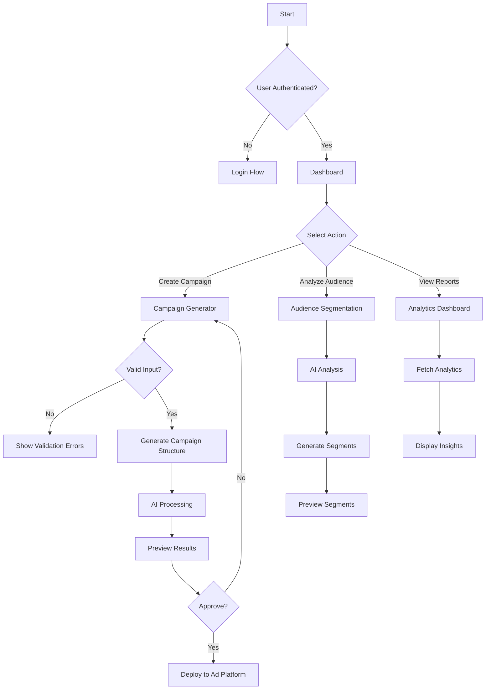

### Integration Workflows

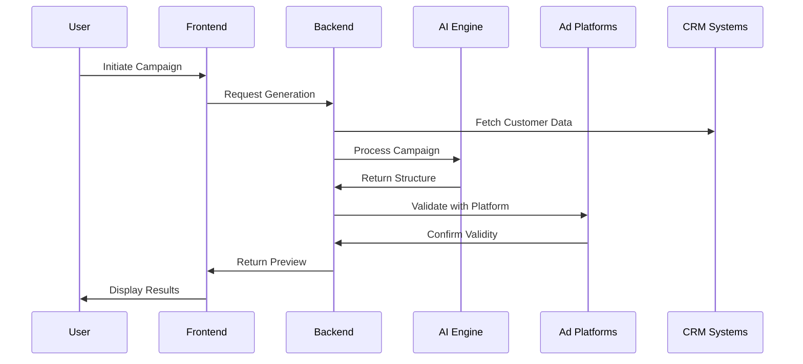

## 3.2. FLOWCHART REQUIREMENTS

### Campaign Generation Flow

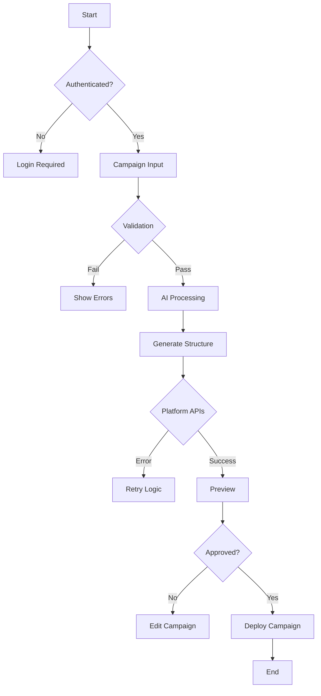

### Error Handling Flow

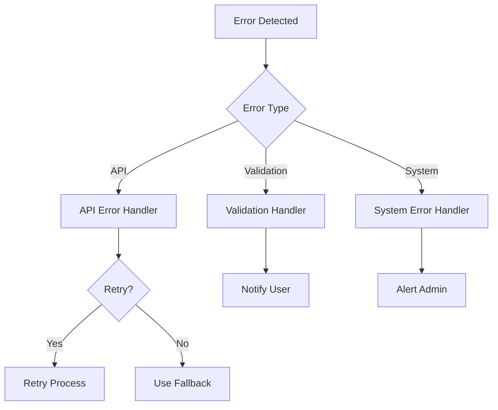

## 3.3. TECHNICAL IMPLEMENTATION

### State Management Flow

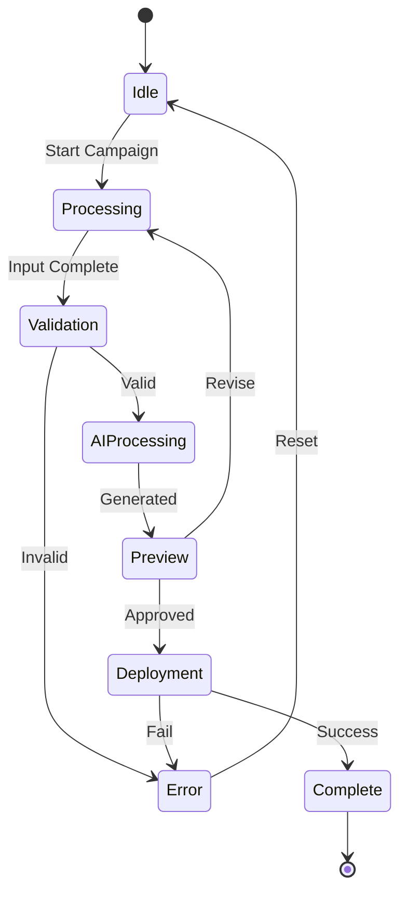

### Integration Sequence

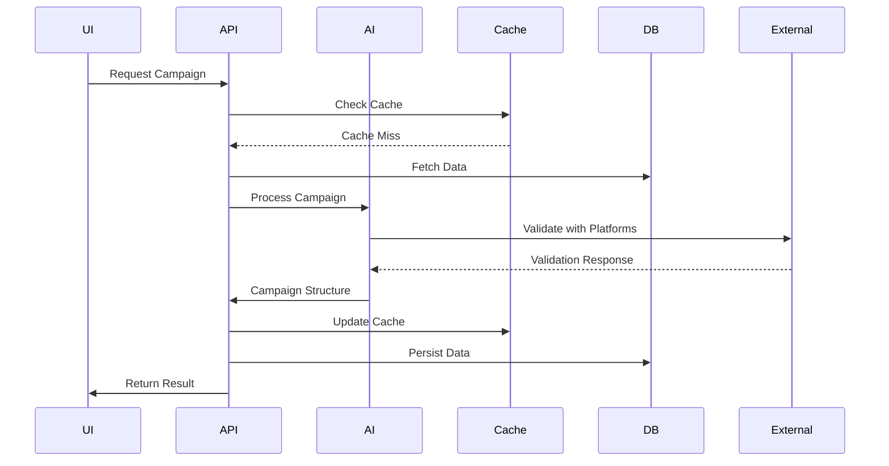

## 3.4. VALIDATION AND COMPLIANCE

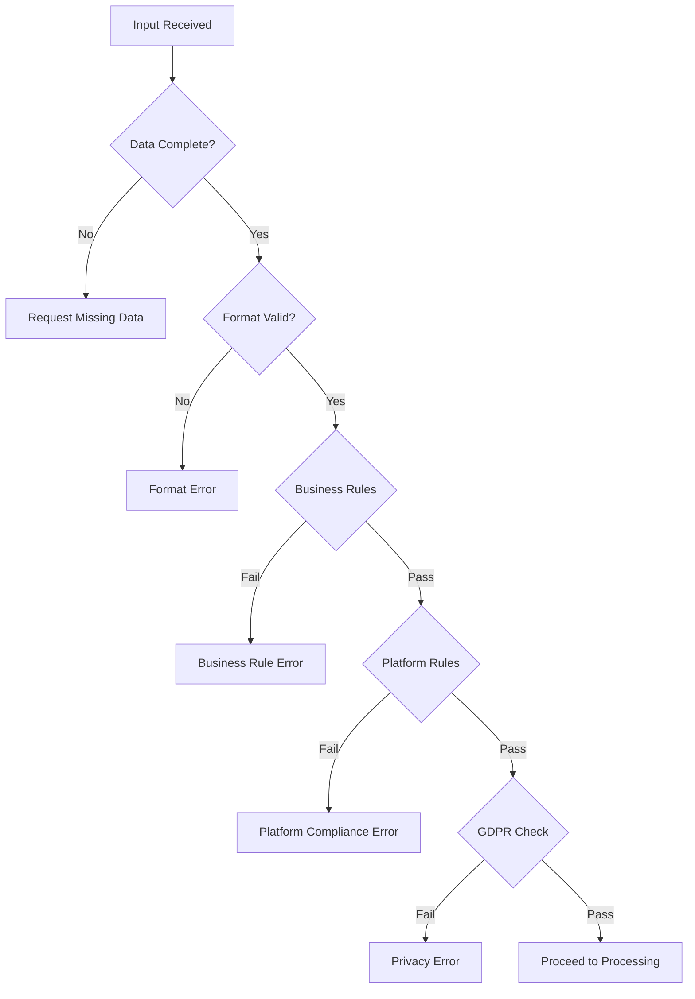

# 4. SYSTEM ARCHITECTURE

## 4.1. HIGH-LEVEL ARCHITECTURE

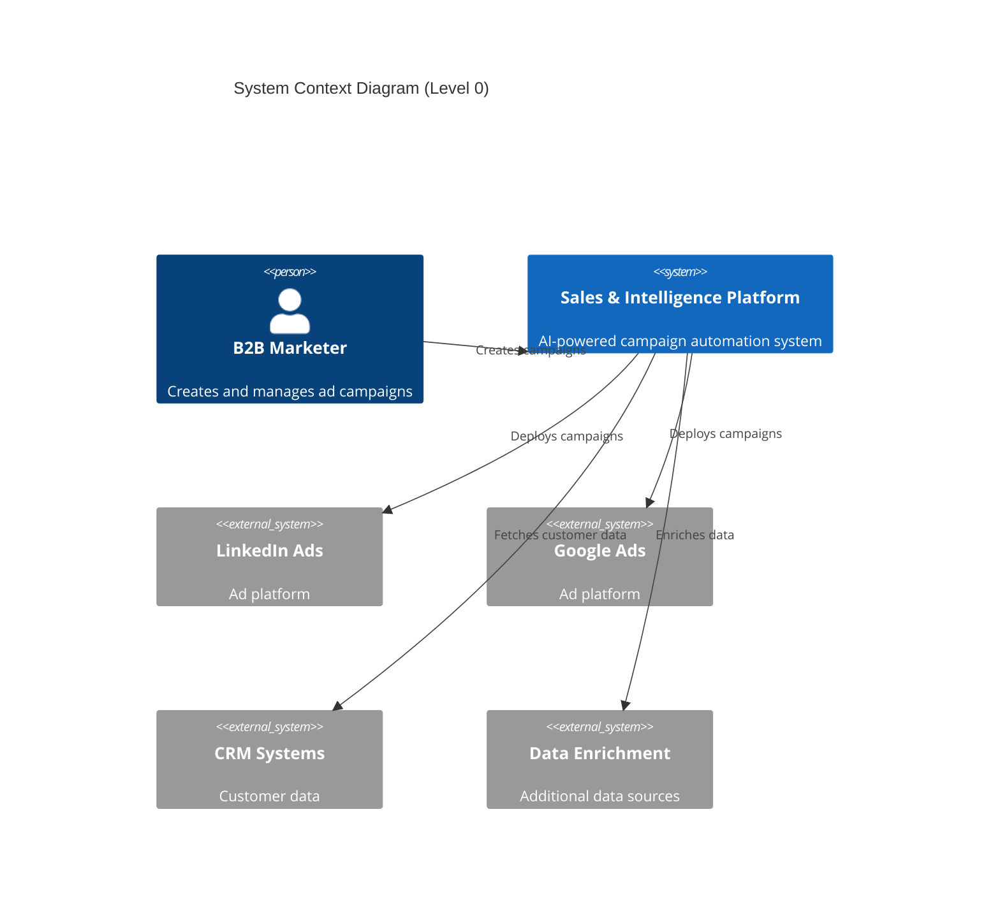

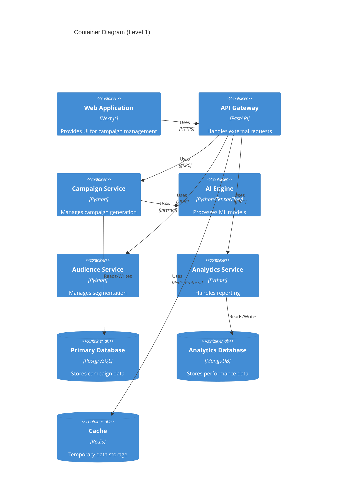

## 4.2. COMPONENT DETAILS

### Core Components Matrix

| Component | Technology | Purpose | Scaling Strategy |
|-----------|------------|---------|-----------------|
| Web Frontend | Next.js/React | User interface | Horizontal with CDN |
| API Gateway | FastAPI | Request handling | Horizontal with load balancer |
| Campaign Service | Python | Campaign management | Horizontal with sharding |
| AI Engine | Python/TensorFlow | ML processing | Vertical with GPU support |
| Audience Service | Python | Segmentation logic | Horizontal with partitioning |
| Analytics Service | Python | Reporting system | Horizontal with read replicas |

### Data Storage Solutions

| Store Type | Technology | Purpose | Scaling Approach |
|------------|------------|---------|------------------|
| Primary DB | PostgreSQL | Campaign data | Master-slave replication |
| Analytics DB | MongoDB | Performance metrics | Sharding |
| Cache | Redis | Session/temporary data | Cluster mode |
| Object Storage | S3 | Media assets | CDN distribution |

## 4.3. TECHNICAL DECISIONS

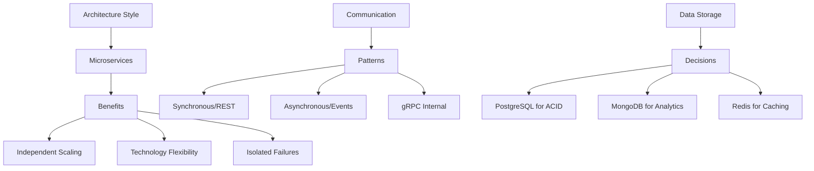

## 4.4. CROSS-CUTTING CONCERNS

### Monitoring Architecture

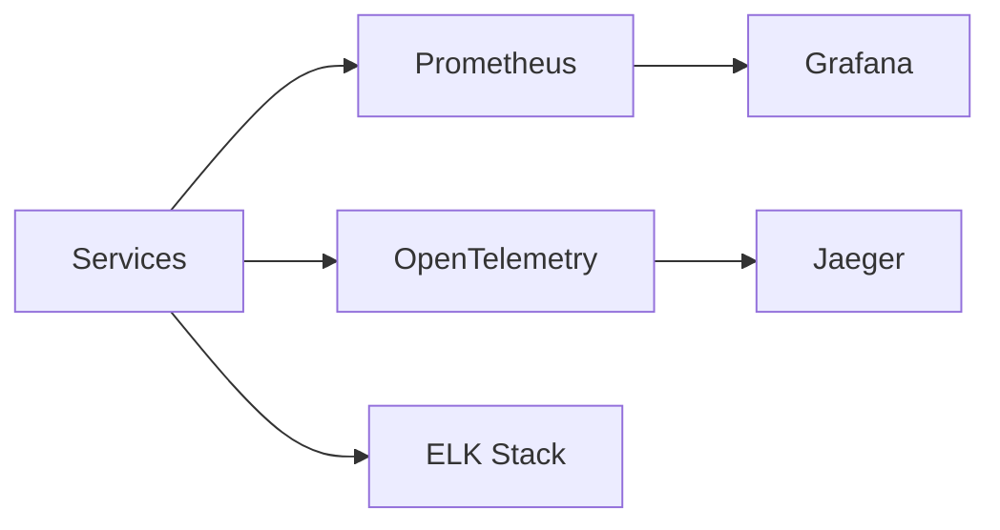

### Security Architecture

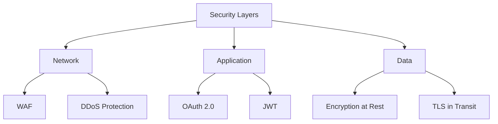

## 4.5. DEPLOYMENT ARCHITECTURE

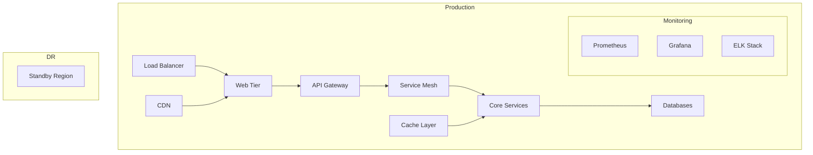

## 4.6. DATA FLOW ARCHITECTURE

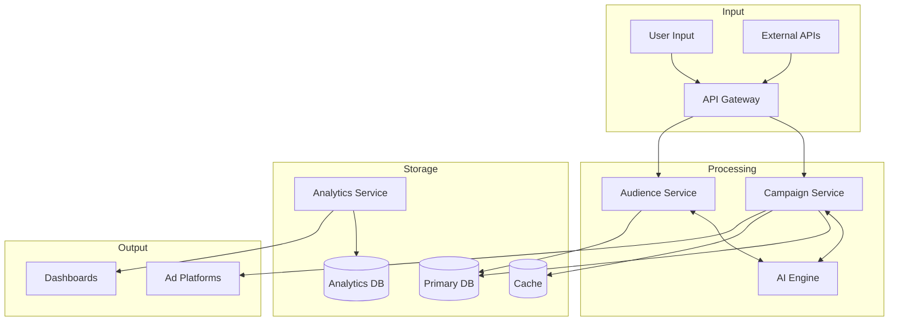

# 5. SYSTEM COMPONENTS DESIGN

## 5.1. CORE SERVICES ARCHITECTURE

### Service Components

| Service | Responsibility | Communication Pattern | Discovery Method |
|---------|---------------|----------------------|------------------|
| Campaign Service | Campaign generation and management | Synchronous (REST/gRPC) | Kubernetes Service Discovery |
| AI Engine | ML model inference and optimization | Asynchronous (Event-driven) | DNS-based discovery |
| Audience Service | Segmentation and targeting | Synchronous/Asynchronous | Service mesh (Istio) |
| Analytics Service | Reporting and insights | Event-driven | Consul |
| Integration Service | External platform connectivity | REST/Webhook | API Gateway |

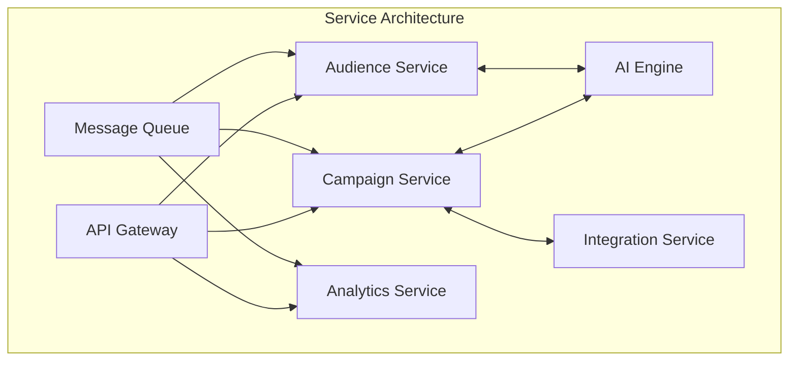

### Scalability Design

| Component | Scaling Strategy | Triggers | Resource Allocation |
|-----------|-----------------|----------|-------------------|
| Campaign Service | Horizontal | CPU > 70%, Memory > 80% | 2-8 pods, 2 CPU, 4GB RAM |
| AI Engine | Vertical + GPU | Model queue depth > 100 | 4-16 CPU, 16GB RAM, 1-4 GPUs |
| Audience Service | Horizontal | Request latency > 200ms | 2-6 pods, 2 CPU, 4GB RAM |
| Analytics Service | Horizontal | Queue depth > 1000 | 2-4 pods, 2 CPU, 8GB RAM |

### Resilience Patterns

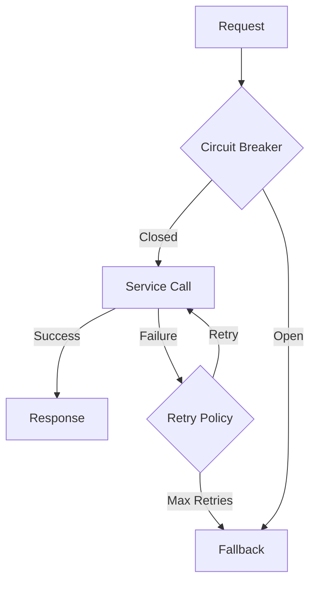

## 5.2. DATABASE DESIGN

### Schema Design

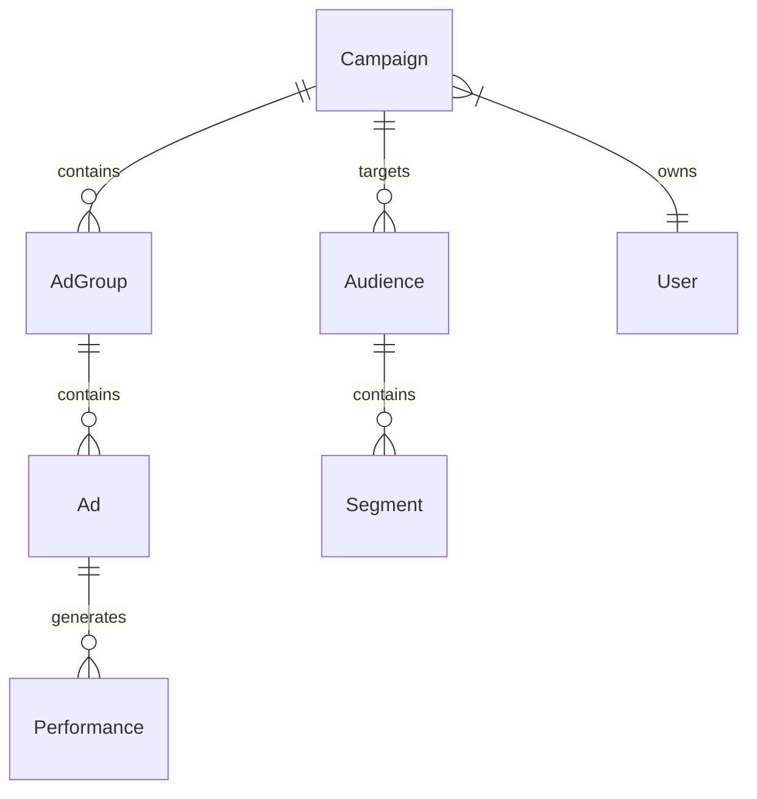

| Entity | Partitioning Strategy | Replication | Backup Frequency |
|--------|---------------------|-------------|------------------|
| Campaigns | Hash by user_id | Multi-AZ | Hourly |
| Audiences | Range by date | Read replicas | Daily |
| Performance | Time-series | Cross-region | Real-time |
| Analytics | Sharding by month | Async replication | Continuous |

### Data Management

| Aspect | Strategy | Implementation |
|--------|----------|----------------|
| Migration | Blue-green deployment | Flyway/Liquibase |
| Versioning | Semantic versioning | Schema version table |
| Retention | Time-based archival | 90 days hot, 1 year warm |
| Privacy | Column-level encryption | AWS KMS |
| Auditing | Change data capture | Debezium |

## 5.3. INTEGRATION ARCHITECTURE

### API Design

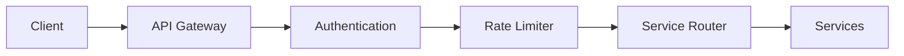

| API Type | Protocol | Auth Method | Rate Limit |
|----------|----------|-------------|------------|
| Campaign API | REST/gRPC | OAuth 2.0 | 100 req/min |
| Analytics API | GraphQL | JWT | 1000 req/min |
| Platform API | REST | API Key | 50 req/min |
| Webhook API | HTTP | HMAC | 500 req/min |

### Message Processing

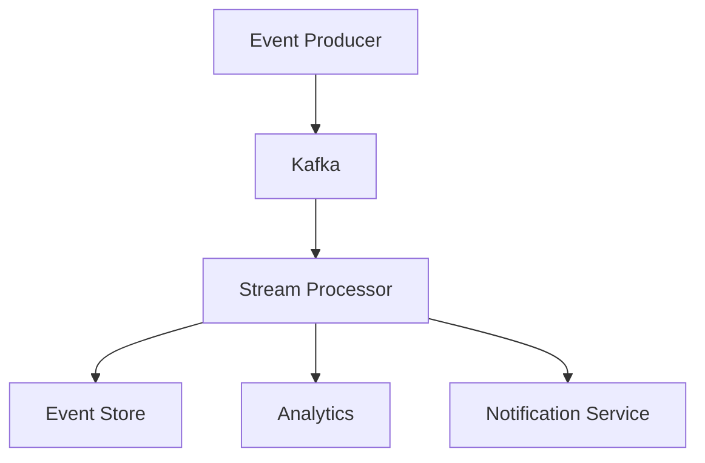

## 5.4. SECURITY ARCHITECTURE

### Authentication Framework

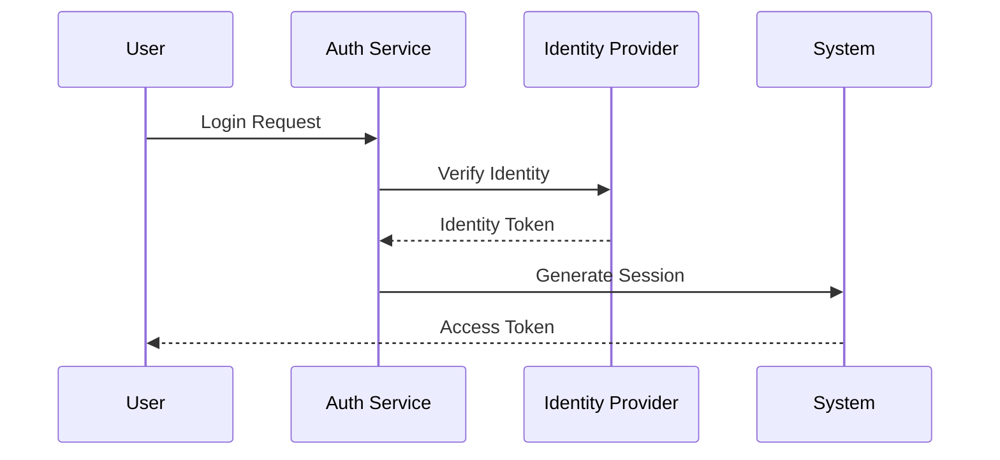

### Authorization System

| Resource | Roles | Permissions | Audit Level |
|----------|-------|-------------|-------------|
| Campaigns | Admin, Manager | Create, Read, Update, Delete | High |
| Audiences | Analyst, Manager | Read, Update | Medium |
| Reports | Viewer | Read | Low |
| Settings | Admin | All | High |

### Data Protection

```mermaid
flowchart TD
    subgraph "Data Security Layers"
        A[TLS 1.3] --> B[Field-level Encryption]
        B --> C[Data Masking]
        C --> D[Access Control]
        D --> E[Audit Logging]
    end
```

| Security Control | Implementation | Standard |
|-----------------|----------------|-----------|
| Encryption at Rest | AES-256 | FIPS 140-2 |
| Transport Security | TLS 1.3 | PCI DSS |
| Key Management | AWS KMS | NIST 800-57 |
| Access Control | RBAC + ABAC | ISO 27001 |

# 6. TECHNOLOGY STACK

## 6.1. PROGRAMMING LANGUAGES

| Layer | Language | Version | Justification |
|-------|----------|---------|---------------|
| Frontend | TypeScript | 5.0+ | Type safety, better IDE support, reduced runtime errors |
| Backend | Python | 3.11+ | ML/AI capabilities, extensive libraries, rapid development |
| AI Services | Python | 3.11+ | TensorFlow/PyTorch compatibility, ML ecosystem |
| Infrastructure | Go | 1.21+ | High-performance microservices, efficient resource usage |
| Scripts | Python | 3.11+ | Consistency with backend, automation capabilities |

## 6.2. FRAMEWORKS & LIBRARIES

### Frontend Stack

| Component | Technology | Version | Purpose |
|-----------|------------|---------|----------|
| UI Framework | Next.js | 14.0+ | Server-side rendering, optimal performance |
| State Management | Redux Toolkit | 2.0+ | Predictable state management |
| UI Components | MUI | 5.0+ | Enterprise-grade components |
| Data Fetching | React Query | 5.0+ | Efficient API data management |
| Forms | React Hook Form | 7.0+ | Performance-focused form handling |

### Backend Stack

| Component | Technology | Version | Purpose |
|-----------|------------|---------|----------|
| API Framework | FastAPI | 0.100+ | High-performance async operations |
| ML Framework | TensorFlow | 2.14+ | Production-grade ML capabilities |
| Task Queue | Celery | 5.3+ | Async task processing |
| API Gateway | Kong | 3.4+ | Rate limiting, authentication |
| GraphQL | Strawberry | 0.204+ | Flexible data querying |

## 6.3. DATABASES & STORAGE

```mermaid
graph TD
    A[Application Layer] --> B[Primary Storage]
    A --> C[Cache Layer]
    A --> D[Analytics Storage]
    
    subgraph "Primary Storage"
    B --> E[(PostgreSQL)]
    B --> F[(MongoDB)]
    end
    
    subgraph "Cache Layer"
    C --> G[(Redis)]
    C --> H[(Elasticsearch)]
    end
    
    subgraph "Analytics Storage"
    D --> I[(ClickHouse)]
    D --> J[(S3)]
    end
```

| Storage Type | Technology | Version | Purpose |
|--------------|------------|---------|----------|
| Primary DB | PostgreSQL | 15+ | Campaign and user data |
| Document Store | MongoDB | 6.0+ | Flexible campaign structures |
| Cache | Redis | 7.0+ | Session and real-time data |
| Search | Elasticsearch | 8.0+ | Full-text search capabilities |
| Analytics | ClickHouse | 23.8+ | High-performance analytics |
| Object Storage | AWS S3 | - | Media and asset storage |

## 6.4. THIRD-PARTY SERVICES

### Integration Matrix

| Category | Service | Integration Method | Purpose |
|----------|---------|-------------------|----------|
| Ad Platforms | LinkedIn Ads API | REST | Campaign deployment |
| | Google Ads API | gRPC | Campaign deployment |
| Authentication | Auth0 | OAuth 2.0 | User authentication |
| Analytics | Mixpanel | REST | User behavior tracking |
| Monitoring | DataDog | Agent | System monitoring |
| Error Tracking | Sentry | SDK | Error reporting |

### Service Dependencies

```mermaid
graph LR
    A[Application] --> B[Auth0]
    A --> C[LinkedIn API]
    A --> D[Google Ads API]
    A --> E[DataDog]
    A --> F[Sentry]
    A --> G[AWS Services]
    
    subgraph "AWS Services"
    G --> H[S3]
    G --> I[SQS]
    G --> J[Lambda]
    end
```

## 6.5. DEVELOPMENT & DEPLOYMENT

### Development Environment

| Tool | Version | Purpose |
|------|---------|----------|
| Docker | 24+ | Container runtime |
| Kubernetes | 1.27+ | Container orchestration |
| Helm | 3.12+ | Package management |
| ArgoCD | 2.8+ | GitOps deployment |

### CI/CD Pipeline

```mermaid
graph TD
    A[Git Push] --> B[GitHub Actions]
    B --> C{Tests Pass?}
    C -->|Yes| D[Build Images]
    C -->|No| E[Notify Team]
    D --> F[Security Scan]
    F --> G{Scan Pass?}
    G -->|Yes| H[Deploy to Staging]
    G -->|No| E
    H --> I[Integration Tests]
    I --> J{Tests Pass?}
    J -->|Yes| K[Deploy to Production]
    J -->|No| E
```

### Infrastructure Configuration

```mermaid
graph TD
    subgraph "Production Environment"
    A[Load Balancer] --> B[Web Tier]
    B --> C[Application Tier]
    C --> D[Database Tier]
    
    E[Monitoring] --> F[Metrics]
    E --> G[Logs]
    E --> H[Traces]
    end
```

# 7. USER INTERFACE DESIGN

## 7.1. DESIGN SYSTEM

### Symbol Key
```
Icons:
[?] - Help/Info tooltip
[$] - Financial/Payment related
[i] - Information
[+] - Add/Create new
[x] - Close/Delete
[<] [>] - Navigation
[^] - Upload
[#] - Menu/Dashboard
[@] - User/Profile
[!] - Alerts/Warnings
[=] - Settings
[*] - Favorite/Important

Components:
[ ] - Checkbox
( ) - Radio button
[Button] - Clickable button
[...] - Text input field
[====] - Progress bar
[v] - Dropdown menu
```

## 7.2. MAIN DASHBOARD

```
+----------------------------------------------------------+
|  [#] Sales & Intelligence Platform     [@] Admin    [=]    |
+----------------------------------------------------------+
|                                                           |
|  Campaign Performance Overview                    [?]      |
|  +--------------------------------------------------+    |
|  |  Active Campaigns: 12    Total Spend: $25,340     |    |
|  |  [====================================] 78%       |    |
|  |  Monthly Budget Utilization                       |    |
|  +--------------------------------------------------+    |
|                                                           |
|  Quick Actions                                           |
|  [+ New Campaign]  [^ Import Data]  [$ Budget Review]    |
|                                                           |
|  Recent Campaigns                              [>]        |
|  +--------------------------------------------------+    |
|  | [*] B2B SaaS Campaign Q4                          |    |
|  |     CTR: 2.4% | Conv: 3.1% | Spend: $5,200       |    |
|  | [ ] Enterprise Solutions Launch                    |    |
|  |     CTR: 1.8% | Conv: 2.7% | Spend: $3,800       |    |
|  +--------------------------------------------------+    |
+----------------------------------------------------------+
```

## 7.3. CAMPAIGN CREATOR

```
+----------------------------------------------------------+
|  Create New Campaign                            [x]        |
+----------------------------------------------------------+
|                                                           |
|  Platform Selection                                       |
|  ( ) LinkedIn Ads                                         |
|  ( ) Google Ads                                          |
|  ( ) Both                                                 |
|                                                           |
|  Campaign Details                                         |
|  Campaign Name: [............................]            |
|  Budget: [$.......]  Duration: [v] 30 days               |
|                                                           |
|  Audience Targeting                             [?]       |
|  +--------------------------------------------------+    |
|  | Industry:    [v] Technology, SaaS                 |    |
|  | Company Size:[v] 50-1000 employees               |    |
|  | Job Titles:  [...] Add multiple titles           |    |
|  | Location:    [v] United States, Canada           |    |
|  +--------------------------------------------------+    |
|                                                           |
|  [< Back]                    [Preview] [Save & Continue] |
+----------------------------------------------------------+
```

## 7.4. AI RECOMMENDATIONS PANEL

```
+----------------------------------------------------------+
|  AI Campaign Recommendations                    [i]        |
+----------------------------------------------------------+
|                                                           |
|  Suggested Ad Copies                                      |
|  +--------------------------------------------------+    |
|  | Title 1: "Boost Your B2B Sales by 300%"          |    |
|  | [ ] Select  [* Save]  [Preview]                  |    |
|  |                                                  |    |
|  | Title 2: "Enterprise Solutions That Scale"       |    |
|  | [ ] Select  [* Save]  [Preview]                  |    |
|  +--------------------------------------------------+    |
|                                                           |
|  Audience Insights                              [!]       |
|  +--------------------------------------------------+    |
|  | Recommended Segments:                              |    |
|  | [v] Tech Decision Makers (Reach: 1.2M)            |    |
|  | [v] Senior IT Leaders (Reach: 800K)               |    |
|  +--------------------------------------------------+    |
|                                                           |
|  [Apply All Selected]          [Customize Recommendations]|
+----------------------------------------------------------+
```

## 7.5. ANALYTICS DASHBOARD

```
+----------------------------------------------------------+
|  Campaign Analytics                            [@]         |
+----------------------------------------------------------+
|  Time Range: [v] Last 30 Days                             |
|                                                           |
|  Performance Metrics                           [$]         |
|  +--------------------------------------------------+    |
|  |  CTR     Conversions     CPC     ROAS            |    |
|  |  2.4%    156            $3.2    3.8x            |    |
|  |  [===========]  [=============]  [========]      |    |
|  +--------------------------------------------------+    |
|                                                           |
|  Audience Engagement                           [>]        |
|  +--------------------------------------------------+    |
|  | Segment        Impressions    Clicks    Conv.     |    |
|  | Tech Leaders   125,000       3,750     82        |    |
|  | IT Decision    98,000        2,940     74        |    |
|  +--------------------------------------------------+    |
|                                                           |
|  [Export Report]  [Schedule Report]  [Share Dashboard]    |
+----------------------------------------------------------+
```

## 7.6. RESPONSIVE DESIGN SPECIFICATIONS

| Breakpoint | Layout Adjustments |
|------------|-------------------|
| Desktop (>1200px) | Full 3-column layout |
| Tablet (768-1199px) | 2-column layout, stacked widgets |
| Mobile (<767px) | Single column, collapsible sections |

## 7.7. INTERACTION PATTERNS

| Component | Primary Action | Secondary Action |
|-----------|---------------|------------------|
| Campaign Card | Click to view details | Long press for quick actions |
| AI Recommendations | Single click to select | Double click to preview |
| Analytics Widgets | Click to expand | Drag to reorder |
| Navigation Menu | Click to navigate | Swipe for mobile menu |

## 7.8. ACCESSIBILITY REQUIREMENTS

| Element | WCAG Requirement | Implementation |
|---------|-----------------|----------------|
| Color Contrast | AA Level (4.5:1) | Primary text: #333 on #FFF |
| Focus States | Visible indicators | 2px blue outline (#0066CC) |
| Screen Readers | ARIA labels | All interactive elements labeled |
| Keyboard Navigation | Full support | Tab order follows visual layout |

# 8. INFRASTRUCTURE

## 8.1. DEPLOYMENT ENVIRONMENT

### Environment Matrix

| Environment | Purpose | Infrastructure | Scaling Strategy |
|------------|---------|----------------|------------------|
| Development | Feature development, testing | AWS EKS (us-east-1) | Manual scaling |
| Staging | Integration testing, UAT | AWS EKS (us-east-1) | Auto-scaling (min 2, max 4) |
| Production | Live system | AWS EKS (Multi-AZ: us-east-1, us-west-2) | Auto-scaling (min 3, max 12) |
| DR | Disaster recovery | AWS EKS (eu-west-1) | Warm standby |

### High Availability Design

```mermaid
graph TD
    subgraph "Production Environment"
        LB[AWS ALB] --> AZ1
        LB --> AZ2
        
        subgraph "AZ1 (us-east-1a)"
            AZ1[EKS Node Group 1]
            AZ1 --> DB1[(RDS Primary)]
        end
        
        subgraph "AZ2 (us-east-1b)"
            AZ2[EKS Node Group 2]
            AZ2 --> DB2[(RDS Standby)]
        end
        
        DB1 -.-> DB2
    end
```

## 8.2. CLOUD SERVICES

### AWS Service Configuration

| Service | Purpose | Configuration | Backup Strategy |
|---------|---------|--------------|-----------------|
| EKS | Container orchestration | 1.27+, managed node groups | N/A |
| RDS | PostgreSQL database | Multi-AZ, r6g.xlarge | Daily snapshots, point-in-time recovery |
| ElastiCache | Redis caching | Cluster mode, r6g.large | Cross-region replication |
| S3 | Object storage | Standard + Glacier | Versioning enabled |
| CloudFront | CDN | Edge locations worldwide | - |
| Route53 | DNS management | Active-active routing | - |

### Service Architecture

```mermaid
graph LR
    subgraph "AWS Infrastructure"
        R53[Route 53] --> CF[CloudFront]
        CF --> ALB[Application Load Balancer]
        ALB --> EKS[EKS Cluster]
        EKS --> RDS[RDS Multi-AZ]
        EKS --> EC[ElastiCache]
        EKS --> S3[S3 Bucket]
    end
```

## 8.3. CONTAINERIZATION

### Docker Configuration

| Component | Base Image | Resource Limits | Health Checks |
|-----------|------------|-----------------|---------------|
| Frontend | node:18-alpine | CPU: 1, Memory: 2Gi | HTTP GET /health |
| Backend | python:3.11-slim | CPU: 2, Memory: 4Gi | HTTP GET /api/health |
| AI Service | pytorch/pytorch:2.0.1 | CPU: 4, Memory: 8Gi, GPU: 1 | HTTP GET /ai/health |
| Analytics | python:3.11-slim | CPU: 2, Memory: 4Gi | HTTP GET /analytics/health |

### Container Security

```mermaid
flowchart TD
    A[Container Image] --> B{Security Scan}
    B -->|Pass| C[Image Signing]
    B -->|Fail| D[Block Deployment]
    C --> E[Image Registry]
    E --> F[Deploy to EKS]
```

## 8.4. ORCHESTRATION

### Kubernetes Architecture

```mermaid
graph TD
    subgraph "EKS Cluster"
        NS1[Frontend Namespace]
        NS2[Backend Namespace]
        NS3[AI Services Namespace]
        NS4[Monitoring Namespace]
        
        NS1 --> SVC1[Frontend Service]
        NS2 --> SVC2[Backend Service]
        NS3 --> SVC3[AI Service]
        NS4 --> PRO[Prometheus]
        NS4 --> GRA[Grafana]
    end
```

### Resource Configuration

| Component | Replicas | Resource Requests | Resource Limits | Auto-scaling Triggers |
|-----------|----------|-------------------|-----------------|---------------------|
| Frontend | 3-6 | CPU: 0.5, Mem: 1Gi | CPU: 1, Mem: 2Gi | CPU > 70% |
| Backend | 3-8 | CPU: 1, Mem: 2Gi | CPU: 2, Mem: 4Gi | CPU > 75% |
| AI Service | 2-4 | CPU: 2, Mem: 4Gi | CPU: 4, Mem: 8Gi | Queue depth > 100 |

## 8.5. CI/CD PIPELINE

### Pipeline Architecture

```mermaid
flowchart TD
    A[Git Push] --> B[GitHub Actions]
    B --> C{Unit Tests}
    C -->|Pass| D[Build Images]
    C -->|Fail| E[Notify Team]
    D --> F[Security Scan]
    F --> G{Quality Gate}
    G -->|Pass| H[Deploy to Staging]
    G -->|Fail| E
    H --> I[Integration Tests]
    I --> J{Tests Pass}
    J -->|Yes| K[Deploy to Production]
    J -->|No| E
    K --> L[Post-deploy Tests]
```

### Deployment Strategy

| Environment | Strategy | Rollback Time | Monitoring Period |
|-------------|----------|---------------|-------------------|
| Staging | Blue/Green | < 5 minutes | 15 minutes |
| Production | Canary | < 3 minutes | 30 minutes |
| DR | Active-Passive | < 15 minutes | 1 hour |

### Automation Tools

| Tool | Purpose | Integration Point |
|------|---------|------------------|
| GitHub Actions | CI/CD orchestration | GitHub repository |
| ArgoCD | GitOps deployment | Kubernetes clusters |
| Helm | Package management | Deployment pipeline |
| Prometheus | Metrics monitoring | Post-deployment validation |
| Datadog | Performance monitoring | Production environment |

# APPENDICES

## A.1. ADDITIONAL TECHNICAL INFORMATION

### A.1.1. API Rate Limits

| Platform | Endpoint Type | Rate Limit | Time Window | Retry Strategy |
|----------|--------------|------------|-------------|----------------|
| LinkedIn Ads | Campaign Creation | 100 requests | Per minute | Exponential backoff |
| LinkedIn Ads | Reporting | 500 requests | Per minute | Fixed interval |
| Google Ads | Campaign Management | 150 requests | Per minute | Exponential backoff |
| Google Ads | Reporting | 1000 requests | Per minute | Fixed interval |
| CRM Systems | Data Sync | 50 requests | Per minute | Queue-based |

### A.1.2. Data Retention Policies

| Data Type | Retention Period | Storage Location | Archival Strategy |
|-----------|-----------------|------------------|-------------------|
| Campaign Data | 2 years | PostgreSQL | S3 Glacier after 1 year |
| Performance Metrics | 3 years | MongoDB | S3 Glacier after 2 years |
| User Activity Logs | 1 year | Elasticsearch | S3 Glacier after 6 months |
| AI Training Data | 5 years | S3 | Compressed after 1 year |

### A.1.3. Error Handling Matrix

```mermaid
flowchart TD
    A[Error Detected] --> B{Error Type}
    B -->|API| C[Rate Limit]
    B -->|Data| D[Validation]
    B -->|System| E[Infrastructure]
    
    C --> F[Queue Request]
    D --> G[Data Cleanup]
    E --> H[Failover]
    
    F --> I[Retry Logic]
    G --> J[Notify User]
    H --> K[Alert DevOps]
```

## A.2. GLOSSARY

| Term | Definition | Context |
|------|------------|---------|
| Campaign Structure | Hierarchical organization of ad groups, ads, and targeting settings | Campaign Generation |
| Audience Segment | Defined group of users sharing common characteristics | Targeting |
| Conversion Rate | Percentage of users who complete desired actions | Analytics |
| ROAS | Return on Ad Spend - Revenue generated per ad dollar spent | Performance |
| Bid Strategy | Automated approach to managing ad auction bids | Campaign Management |
| Look-alike Audience | Similar users based on existing customer profiles | Targeting |
| A/B Test | Comparative testing of two ad variations | Optimization |
| Sales Intelligence | Data-driven insights about potential customers | Targeting |

## A.3. ACRONYMS

| Acronym | Full Form | Usage Context |
|---------|-----------|---------------|
| API | Application Programming Interface | System Integration |
| CRM | Customer Relationship Management | Data Source |
| CTR | Click-Through Rate | Performance Metric |
| CPC | Cost Per Click | Bidding Metric |
| ROAS | Return on Ad Spend | Performance Metric |
| ML | Machine Learning | AI Processing |
| NLP | Natural Language Processing | Content Generation |
| SDK | Software Development Kit | Integration |
| SLA | Service Level Agreement | Performance |
| UI/UX | User Interface/User Experience | Frontend Design |
| JWT | JSON Web Token | Authentication |
| RBAC | Role-Based Access Control | Security |
| CDN | Content Delivery Network | Infrastructure |
| DNS | Domain Name System | Infrastructure |
| TLS | Transport Layer Security | Security |

## A.4. COMPLIANCE REQUIREMENTS

```mermaid
graph TD
    A[Compliance Requirements] --> B[Data Privacy]
    A --> C[Security]
    A --> D[Platform Rules]
    
    B --> E[GDPR]
    B --> F[CCPA]
    
    C --> G[SOC 2]
    C --> H[ISO 27001]
    
    D --> I[LinkedIn Policies]
    D --> J[Google Ads Policies]
```

### A.4.1. Compliance Matrix

| Requirement | Standard | Implementation | Validation |
|-------------|----------|----------------|------------|
| Data Privacy | GDPR/CCPA | Data encryption, consent management | Quarterly audit |
| Security | SOC 2 | Access controls, monitoring | Annual certification |
| Ad Platform | LinkedIn/Google | Policy compliance checks | Automated validation |
| Infrastructure | ISO 27001 | Security controls, documentation | Annual audit |